```{r setup, include=FALSE}
knitr::opts_chunk$set(echo = TRUE)
```

## About reviseR
reviseR is a simple Shiny app that I wrote to help me revise for an ITEC examination.  reviseR randomly selects multiple choice questions to present to you as part of your revision.  The questions and answers are defined in Microsoft Excel workbooks.  reviseR is, and always will be, free for personal use.

Your questions can have an arbitrary number of possible answers, and arbitrary number of correct answers and you can provide an optional explanatory text that is displayed after the user has submitted their answer.  Answers can be displayed in a fixed order, a random order or a combination of the two.  If you assign questions to categories (and subcategories), you can filter the questions available to focus your revision on particular areas of study.

You can choose how many questions to answer in each revision test and, optionally, impose a limit on how much time you have to answer the questions.

You can provide questions and answers in any language but the reviseR GUI is available only in UK English.

Currently, it is not possible to 

* maintain a log of your revision scores when using reviseR.
* print or save a transcript of a revision quiz
* Include images in questions, answers or help texts

reviseR should work in any browser (eg Safari, Firefox, Explorer) on any platform (eg Windows, OS X, Linux) on any device (phone, tablet, laptop or desktop) but the majority of testing has been done using Firefox running under OS X 10.14.6 (Mojave) on a Mac Pro desktop.

## Accessing reviseR
There are two ways to access reviseR:

* as a web page at https://puzzledface.shinyapps.io/reviseR.  This method is available to everyone.  If you choose this method, you will need to upload the questions you want to revise each time you access the app.
* as an app running locally on your own device.  This method requires that you have a copy of R installed on your machine and you must download a copy of the application's source code from http://www.github.com/puzzledface/reviseR.  R can be obtained [here](http://www.r-project.org).  If you choose this method, you can save your question files in the application's `/www` sub-folder so that you don't have to upload them each time you use the app.

## Using reviseR
### Choosing the questions
Once you've uploaded your Q&A workbook, you're ready to start revising.  The first place to go is the Question filter box.  You can use this to focus your revision in a particular area.  The Question filter box looks like this:

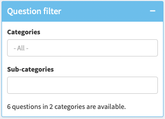

The Question filter box allows you to filter the available questions by the values of Category and SubCategory that are defined in the Q&A workbooks.  You can select multiple values in each combo box.  If a sub-category label is used in more than one of the categories you've selected, it's not possible to include questions in the sub-category from one category but not from the other: either they are all included or all excluded.

The Question filter box also gives you a count of the number of questions (and the number of categories from which they are drawn) available, based on your selections.

Next, check the settings in the Test options box.  This lets you chose the number of questions in your revision quiz and if you'd like to time yourself.  If you chose to time yourself, you may also choose to *limit* the time you can spend on your quiz.    The Test options box looks like this:

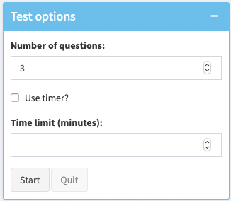

### Answering the quiz

Once you're happy with your question filter and test options, click the Start button in the Test options box.  This will start your test, and the first question will appear in the Questions box:

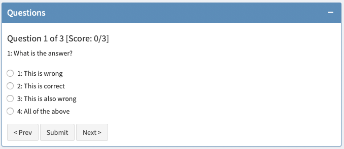

If the question has only one correct answer, the possible answers appear as round radio buttons.  If the question has more than one correct answer (you are required to select them all, don't forget), the answers appear as square checkboxes. (See XXXXX below).  The Questions box also indicates which question you are answering and how many questions you have answered correctly so far.

Select the answers you believe are correct and, when you are ready, click the Submit button.  Only your first answer will be accepted, so make sure you are happy with your choice before you click Submit.  Once you do click Submit, the Questions box will update to show if you are correct.

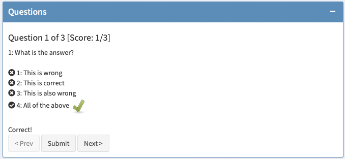

Here, the grey ticks and crosses to the left of the answers shows you which ones the person who compiled the questions has marked as correct.  The green tick indicates both the answer you chose and that your answer was correct.  If you'd answered incorrectly, your chosen answer would be indicated by a red cross:

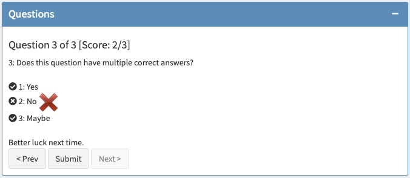

reviseR also tells you if your answer was right or wrong, and updates your score.

If the person who compiled your question also provided some help text, it is displayed as soon as you click on the Submit button:

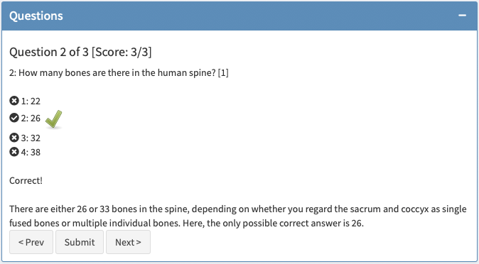

When you're ready, you can move to the next question (or review your answers to previous questions) by using the Next and Prev buttons.

You don't have to submit your answer the current question before looking at other questions with the Next and Prev buttons, but your answer won't be saved until you do click on Submit.

## Defining questions and answers
Questions and answers are defined in one or more Excel workbooks.  

The [reviseR GitHub repository](http://www.github.com/puzzledface/reviseR) currently includes at least one sample Q&A workbook.  However, I make no promises about the number of workbooks, nor their content.  I am using these workbooks to help with my testing of reviseR (and to revise for an ITEC course that I am currently taking).

### The layout of the Excel workbook
Each workbook must contain a worksheet named "Questions" and another named "Answers".  Unsurprisingly, questions are defined in the Questions worksheet and answers in the Answers worksheet.  The workbook can have any name.  You may use any number of workbooks.

#### The Questions worksheet
The screenshot below shows a sample Questions worksheet.

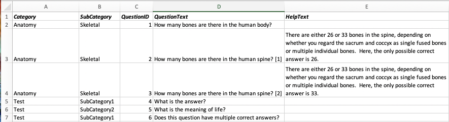
  
As you can see, the worksheet contains five columns:

* Category defines the category to which the question belongs.  Categories are arbitrary and case-sensitive.
* SubCategory defines the sub-category to which the question belongs.  Sub-categories are arbitrary and case-sensitive.  The same label can be used in multiple Categories.
* QuestionID uniquely identifies the question.  Question IDs must be numeric and *_unique across all workbooks_* loaded in a single reviseR session.  Question IDs need not be integers, but this is recommended.
* QuestionText defines the text that will be presented to the user to pose the question.  The question text must be provided.
* HelpText defines the optional help text that is displayed to the user after they have chosen their answer and clicked the Submit button.
* Image is not currently used
* HelpImage is not currently used

Each row of the Questions worksheet defines a separate question.

#### The Answers worksheet
The screenshot below shows an extract of a sample Answers worksheet.  This extract shows the answers to the question in the first row of the screenshot above.

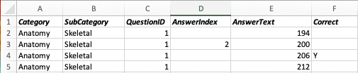
  
As you can see, the worksheet contains six columns:

* `Category`, `SubCategory` and `QuestionID` have the same meaning as in the Questions worksheet.  These columns define the link between each question and its answers.  It is vital that the values in these columns match exactly between the two worksheets.  If they don't reviseR will be unable to link the questions and answers and the results may be unpredicatable.
* `AnswerIndex` defines the order in which the answers are presented to the user.  This column should either be blank or an integer in the range 1 to the number of rows of the Answers workbook with the corresponding combination of `Category`, `SubCategory` and `QuestionID`.  If a value is present, the position of this answer in the list of answers is given by the value of `AnswerIndex`.  If `AnswerIndex` is missing, then the answer will appear in a random position within the list of answers.  So, in the screenshot above, the answer "200" will always appear second in the list of four answers.  The other three answers will appear in random positions.  You may fix the positions of all, none or some of the answers to each question.
* `AnswerText` defines the text to be displayed as the answer to the question.  Here, the possible answers are 194, 200, 206, and 212.
* `Correct` indicates if the given answer is correct.  Correct answers are indicated by [truthy](https://shiny.rstudio.com/reference/shiny/latest/req.html) values - essentially any non-missing value, though using values of "Y", "y", "Yes" or "TRUE" is recommended.  Here, 202 is the only correct answer.  [The corresponding question, indicated by the value of `QuestionID`, is "How many bones are there in the human body?".]  A question may have more than one correct answer, in which case you must select all of the correct answers (and none of the incorrect answers!) for the question to be marked correct.
* Image is not currently used

### Making the workbook available to reviseR
You can upload question and answer files using the Question files box on the Settings tab.

First, click Settings in the sidebar menu:
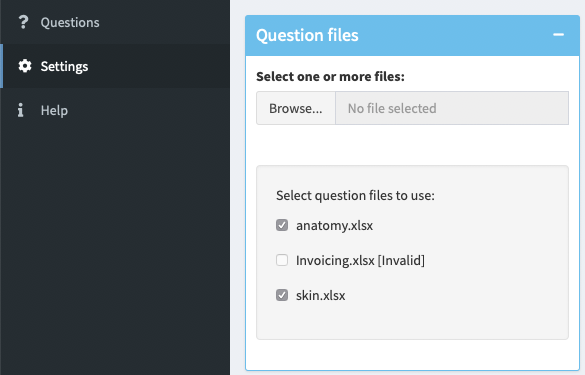

Click the Broswe button to select the workbook containing the questions you want to use and click Open:
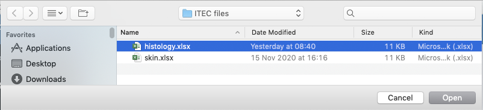

reviseR will upload the file and perform basic validation checks.  If the upload is successful and the file is valid, you'll see a dialog like this:
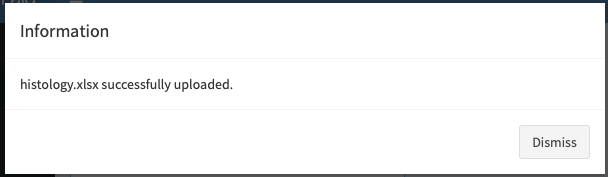

Otherwise, reviseR will give you a brief summary of the problems it found:
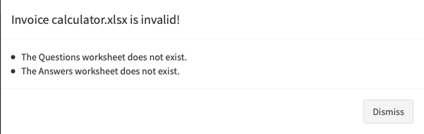

The box containing the question files will be updated to include the new file.  The questions it contains will be automatically added to the list of available questions.

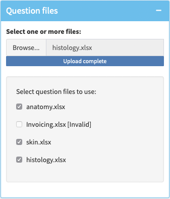

If the question file is invalid, it will be marked as such in the list of available files and you won't be able to select it for inclusion in the available questions.

If the question file is valid, simply check the corresponding box to include its questions or uncheck the box to exclude its questions.  The questions will be included by default.

## To do
reviseR is a work in progress.  It's usable, but it's not perfect.  Problems I know of are listed below.  If you find any more, or have suggestions for improvement, please don't hesitate to get in touch.

### Known problems

*  When doing a timed revsion quiz, it is possible to continue to answer questions even after time has expired.
*  The Next button sometimes remains enabled even when the last question in the quiz is on screen.  Clicking the Next buttonat this time causes an error, but the app appears to continue to work correctly: for example, the Prev button can be used to return to the final quiz question.

<div style="text-align: right">
John Kirkpatrick  
November 2020
</div>
